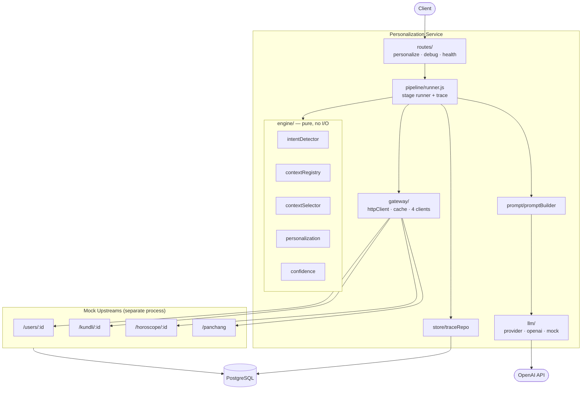
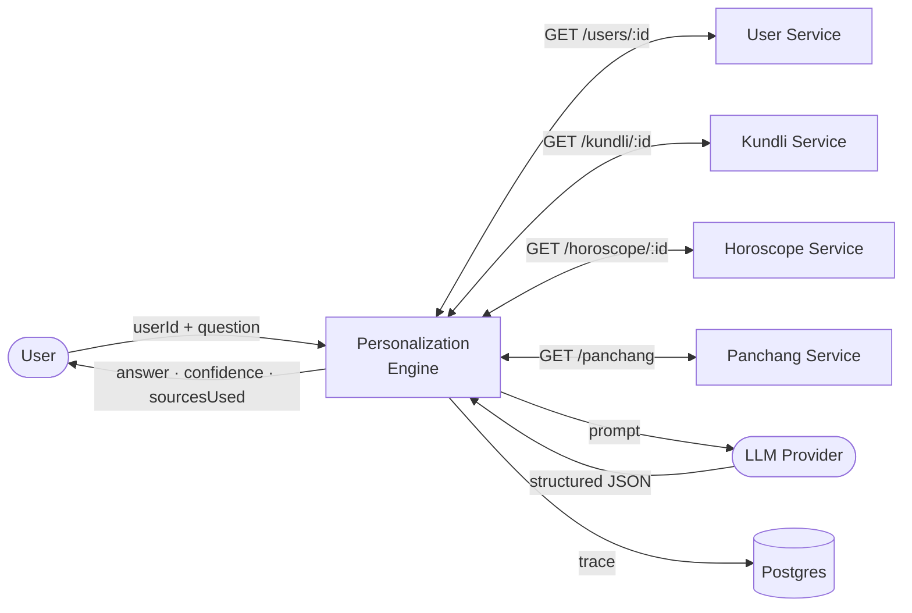
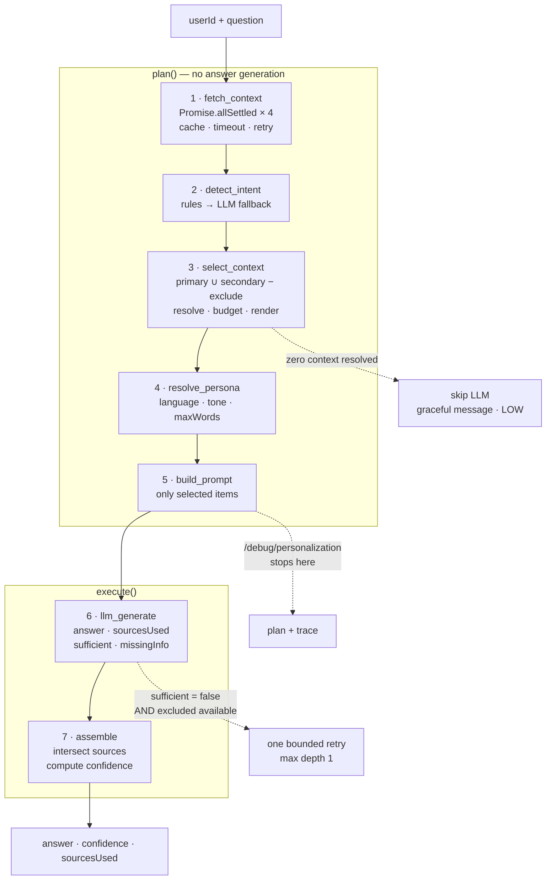

# Architecture

## Component view

The service sits between four astrological microservices and an LLM. `src/engine/` is pure —
it imports nothing from `gateway/`, `llm/`, or `store/`, which is what makes it testable without
mocks and keeps the selection logic honest.



## Data flow — level 0



## Data flow — level 1, the pipeline

`/personalize` runs `[...PLAN, ...EXECUTE]`. `/debug/personalization` runs `PLAN`. Same array,
one slice shorter — so the debug endpoint cannot drift from the real pipeline, and it is
LLM-free by construction rather than by convention.



## Data model

`panchang` has no `user_id` — it is global for a given date, which is why its cache key is the
date alone. `horoscope` is keyed `(user_id, for_date)` because horoscopes are daily.
`kundli_houses` supports all twelve houses; only 6, 7 and 10 are seeded, matching the payload
the assignment specifies.

The first five tables back the **mock upstream services**. `requests` belongs to the
**personalization service** and stores one row per call.

```mermaid
erDiagram
    USERS ||--|| KUNDLI : "has one"
    USERS ||--o{ KUNDLI_HOUSES : "has many"
    USERS ||--o{ HOROSCOPE : "has one per day"
    USERS ||--o{ REQUESTS : "generates"

    USERS {
        text id PK
        text name
        text language
        text subscription
        text tone_preference
        date birth_date
        time birth_time
        text birth_place
    }
    KUNDLI {
        text user_id PK_FK
        text lagna
        text moon_sign
        text mahadasha
        text antardasha
    }
    KUNDLI_HOUSES {
        text user_id PK_FK
        int house PK
        text lord
        text strength
    }
    HOROSCOPE {
        text user_id PK_FK
        date for_date PK
        text career
        text finance
        text health
        text relationship
    }
    PANCHANG {
        date for_date PK
        text tithi
        text nakshatra
        text yoga
        text karana
    }
    REQUESTS {
        uuid request_id PK
        text user_id
        text question
        text intent
        text intent_method
        text confidence
        text_array selected_context
        jsonb excluded_context
        int available_tokens
        int prompt_tokens
        int reduction_pct
        int total_ms
        int llm_ms
        bool sufficient
        text missing_info
        text_array degradations
        jsonb context_bundle
        text prompt_text
        jsonb trace
        timestamptz created_at
    }
```

## Two roles for storage

| Store | Holds | Why |
|---|---|---|
| **In-memory TTL cache** | upstream responses | the assignment's caching requirement; per-process, no infrastructure |
| **Postgres** | mock seed data + request traces | realistic upstreams and durable observability |

They solve different problems. Postgres never caches upstream responses.

## Module dependency rule

```
routes/  →  pipeline/  →  engine/     (pure)
                       →  gateway/    (I/O)
                       →  prompt/
                       →  llm/        (only place a provider is named)
                       →  store/
```

One direction only. `engine/` sits at the bottom and imports nothing that touches the network,
the filesystem, or a database. Verified mechanically:

```bash
grep -rn "require(.*\(gateway\|llm\|store\|express\)" src/engine/   # must be empty
```
