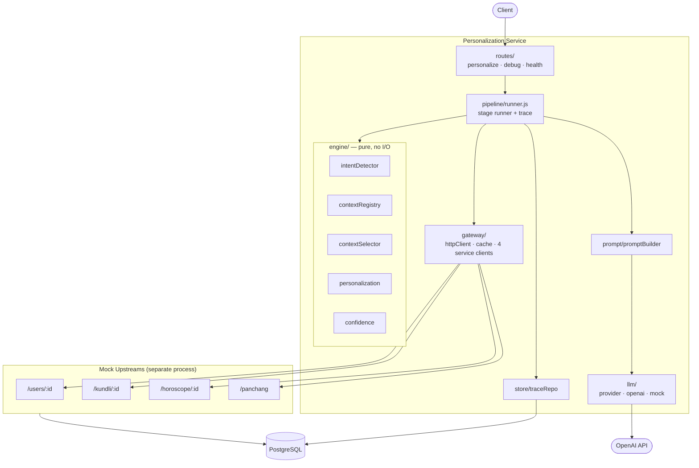
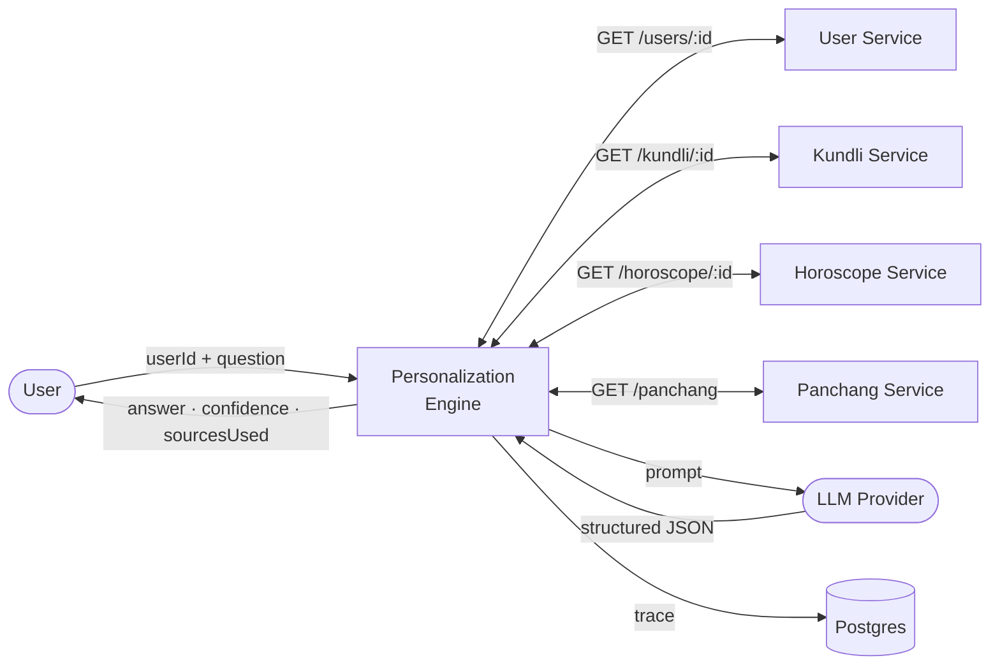
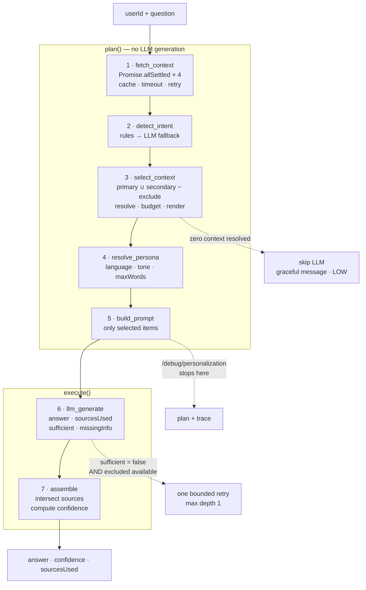

# Personalized AI Context Engine — Design Spec

**Date:** 2026-08-15
**Assignment:** MyNaksh — Backend + AI Engineer
**Deadline:** Sunday 2026-08-16, 12:00
**Stack:** Node.js + Express (plain JavaScript), PostgreSQL (Docker), OpenAI

---

## 1. Problem

MyNaksh personalizes every AI response using a user's astrological profile, preferences, and
question. Four backend services already produce structured astrological data. This project builds
the **intelligence layer between those services and the LLM**.

Its job: gather context, understand the question, select only what matters, personalize the
response configuration, build an optimized prompt, and return a grounded answer.

### What is being evaluated

| Criterion | Where this design answers it |
|---|---|
| Select the right context for a question | §6 Context Registry, §7 Intent Config, §8 Selection |
| Maintainable, extensible Personalization Engine | §6–§9, extensibility table in §17 |
| Clean backend services, good engineering practices | §4 Architecture, §12 Resilience, §13 Observability |
| Optimize information sent to the LLM (not everything) | §8 Selection, §10 Prompt, token budget logging |
| Thoughtful engineering trade-offs | §18 Trade-offs |

---

## 2. Goals / Non-Goals

**Goals**
- `POST /personalize` → `{ answer, confidence, sourcesUsed }`
- `POST /debug/personalization` → the personalization plan, **without invoking the LLM**
- Concurrent, resilient upstream fetching with retries, timeouts, partial-failure tolerance
- Configuration-driven intent → context mapping; no `if/else` chains
- Personalized language, tone, and response length from the user profile
- Measured token reduction versus sending everything
- Structured logging, latency logging, prompt-size logging, in-memory caching

**Non-Goals** (deliberate, documented in README)
- Authentication, authorization, rate limiting
- Multi-turn conversation / memory
- Streaming responses
- Vector search / RAG (see §18 — there is no corpus)
- Agentic retrieval loop (see §18)
- Horizontal scaling concerns (distributed cache, queueing)

---

## 3. Execution Model — deterministic, not agentic

**Decision: deterministic composite pipeline with one bounded escalation.**

The full context universe is **11 items across 4 services**, and all of it is fetched concurrently
in step 1. An agentic retrieval loop exists to solve *"the corpus is too large to fetch whole —
decide what to pull, assess, pull more."* That problem does not exist here: a second loop would
re-request bytes already in memory. It cannot add information, only latency (4–8× LLM calls).

The genuinely agentic decision — *is this context sufficient?* — is captured **without a loop** by
having the generation call return `sufficient` and `missingInfo` in its structured output. That
feeds confidence scoring and a single, hard-capped retry.

Revisit trigger: an unbounded corpus (shastra texts, remedies), multi-turn conversation, or
multi-hop questions.

---

## 4. Architecture



**Dependency rule:** `engine/` imports nothing from `gateway/`, `llm/`, or `store/`. It is pure
functions over plain data — which is what makes it unit-testable without mocks.

### Project structure

```
src/
  server.js
  routes/          personalize.js · debug.js · health.js
  pipeline/        runner.js · stages.js
  gateway/         httpClient.js · cache.js · services/{user,kundli,horoscope,panchang}.js
  engine/          intentDetector.js · contextRegistry.js · contextSelector.js
                   personalization.js · confidence.js
  prompt/          promptBuilder.js · templates.js
  llm/             provider.js · openaiProvider.js · mockProvider.js
  store/           db.js · traceRepo.js
  config/          registry.yaml · intents.yaml · personalization.yaml
                   confidence.yaml · services.yaml · schema.js
  observability/   logger.js
mocks/
  server.js · repo/{index,pgRepo,fixtureRepo}.js · fixtures/*.json
db/
  schema.sql · seed.js
test/
docker-compose.yml
```

---

## 5. Data Flow

### Level 0 — context diagram



### Level 1 — the pipeline



**The key structural property:**

```js
const PLAN    = [fetch_context, detect_intent, select_context, resolve_persona, build_prompt];
const EXECUTE = [llm_generate, assemble];

POST /personalize            → run([...PLAN, ...EXECUTE], ctx)
POST /debug/personalization  → run(PLAN, ctx)
```

The debug endpoint **cannot drift** from the real pipeline — it is the same stage array, one slice
shorter. LLM-free by construction, not by a parallel implementation.

---

## 6. Context Registry — the core data model

Every item that can reach the LLM has a stable ID and one registry entry.

```yaml
- id: kundli.house.10
  label: "10th House"           # appears in sourcesUsed
  source: kundli                # which upstream provides it
  path: "houses.10"             # extraction path
  render: "lord {lord}, strength {strength}"
  estTokens: 18
```

### The complete universe — 11 items

| # | ID | Source | Label |
|---|---|---|---|
| 1 | `kundli.lagna` | kundli | Lagna |
| 2 | `kundli.moonSign` | kundli | Moon Sign |
| 3 | `kundli.dasha` | kundli | Current Dasha |
| 4 | `kundli.house.6` | kundli | 6th House |
| 5 | `kundli.house.7` | kundli | 7th House |
| 6 | `kundli.house.10` | kundli | 10th House |
| 7 | `horoscope.career` | horoscope | Career Horoscope |
| 8 | `horoscope.finance` | horoscope | Finance Horoscope |
| 9 | `horoscope.health` | horoscope | Health Horoscope |
| 10 | `horoscope.relationship` | horoscope | Relationship Horoscope |
| 11 | `panchang.today` | panchang | Today's Panchang |

**Excluded from the registry by design:** `user.birthDetails`. It is PII and it is redundant — the
kundli is the derived output of that birth data. Excluding it is simultaneously a privacy decision
and a token optimization.

**User service is configuration, not context.** `language`, `tonePreference`, and `subscription`
shape *how* the LLM answers; they never appear as astrological facts in the context block.

**Known gap:** the Kundli payload exposes only houses 6, 7, and 10. `finance` has no natural house
(2nd, 11th). Documented, not hidden — filling it is one seed row + one registry entry + one YAML
line, with zero engine changes.

---

## 7. Intent Configuration

```yaml
career:
  match:
    keywords: [job, career, work, promotion, salary, boss, office, business, interview, appraisal]
    patterns: ["chang.*job", "switch.*compan", "quit.*work"]
  primary:   [horoscope.career, kundli.house.10]
  secondary: [kundli.dasha, panchang.today]
  exclude:   [horoscope.relationship]
  maxWordsOverride: null
```

Six intents. The first four reproduce the brief's Example Mapping exactly.

| Intent | Primary | Secondary | Exclude |
|---|---|---|---|
| `career` | `horoscope.career`, `kundli.house.10` | `kundli.dasha`, `panchang.today` | `horoscope.relationship` |
| `relationship` | `horoscope.relationship`, `kundli.house.7` | `kundli.moonSign`, `kundli.dasha` | `horoscope.career` |
| `health` | `horoscope.health`, `kundli.house.6` | `kundli.moonSign`, `panchang.today` | `horoscope.finance` |
| `finance` | `horoscope.finance` | `kundli.dasha`, `kundli.lagna` | `horoscope.relationship` |
| `daily_summary` | `panchang.today` | `horoscope.career`, `horoscope.health`, `kundli.dasha` | — |
| `general` | all 11 | — | — |

`daily_summary` exists because two of the brief's sample questions carry no domain keyword and are
temporally scoped — *"What should I prioritize this week?"*, *"Can you summarize today's guidance?"*

### Intent detection — hybrid

```
score keywords + patterns
  → score ≥ threshold (0.6)   : intent, method="rule",     confidence=1.0
  → score <  threshold        : LLM classifier (structured output)
                                intent, method="llm",      confidence=model score
  → LLM unavailable / errors  : intent="general", method="fallback", confidence=0.4
```

Rules resolve the common path for free and deterministically, which is what keeps
`/debug/personalization` LLM-free in practice as well as by construction.

---

## 8. Context Selection

```
selected = (primary ∪ secondary) − exclude
```

**Exclude always wins** — if a misconfiguration lists an ID in both `secondary` and `exclude`, it is
dropped. Deterministic precedence, one test.

Algorithm:
1. Union primary and secondary
2. Subtract the explicit `exclude` list
3. Resolve each ID against the fetched bundle; unresolvable → `unavailable[]`
4. Token budget: if over, trim from the **secondary tail only**. Primary is never dropped —
   missing primary is a confidence signal, not a budget one
5. Render each surviving item via its `render` template

### Two kinds of exclusion

```
excludedContext  = the explicit `exclude` list — deliberate, contrastive.
                   Matches the brief's debug example exactly (one item, not seven).
notSelected      = the implicit remainder, reason "not_relevant". Reported in detail only.
```

### Output contract

```js
selectContext(intentConfig, bundle, budget) → {
  selected:    [{ id, label, text, estTokens }],   // resolved AND rendered
  excluded:    [{ id, label, reason: 'intent_rule' }],
  notSelected: [{ id, label, reason: 'not_relevant' }],
  unavailable: [{ id, label, source }],
  budget:      { available, sent, reductionPct }
}
```

`buildPrompt(selected, persona, question)` — **no bundle parameter.** Requirement "using only the
selected context" is enforced structurally: excluded data is not reachable at prompt-build time.

---

## 9. Personalization Resolution

```yaml
tone:
  motivational: "Encouraging and action-oriented. Second person. Open with affirmation."
  neutral:      "Balanced and factual. Neither alarming nor effusive."
  direct:       "Blunt and concise. Lead with the conclusion."
language:
  en: English
  hi: Hindi
length:
  free:    120
  premium: 250
defaults:
  language: en
  tone: neutral
  subscription: free
```

Resolved from the user profile. If the User service is unreachable (timeout/5xx, **not** 404),
defaults apply and confidence degrades.

### The four axes of personalization

| Axis | Source | Effect |
|---|---|---|
| **What context** | intent × registry config | **changes the substance of the answer** |
| Language | `user.language` | en / hi |
| Tone | `user.tonePreference` | motivational / neutral / direct |
| Depth | `user.subscription` | premium 250 words, free 120 |

Axis 1 is the one being graded — it changes what the answer *knows*, not how it sounds.

---

## 10. Prompt & Grounding Contract

```
SYSTEM
You are an astrology guidance assistant for MyNaksh.

GROUNDING
- Use ONLY the context provided below.
- Never invent placements, dashas, nakshatras, or dates.
- If the context is insufficient, say so plainly and set sufficient=false.
- Never mention that any context was withheld.

STYLE
- Language: {language}
- Tone: {toneInstruction}
- Length: at most {maxWords} words.

USER
QUESTION: {question}

CONTEXT:
[Career Horoscope]  Networking may bring new opportunities.
[10th House]        lord Moon, strength Strong
[Current Dasha]     Mahadasha Rahu, Antardasha Mars
[Today's Panchang]  Tithi Shukla Panchami, Nakshatra Rohini, Yoga Siddhi, Karana Bava
```

The `[Label]` prefix is load-bearing: it is how the model cites sources and how citations are verified.

**Structured output** (OpenAI `json_schema` mode):

```json
{ "answer": "string", "sourcesUsed": ["string"], "sufficient": true, "missingInfo": null }
```

**Source validation:**

```js
sourcesUsed = intersect(model.sourcesUsed, selected.map(s => s.label));
// outside the sent set → dropped, logged as hallucinated_source
// empty after intersection → fall back to primary labels, log attribution_fallback
```

The model can never credit a source that was not sent. Nothing extra goes in; nothing invented
comes out.

### Bounded escalation — the only loop in the system

```
if (result.sufficient === false && excluded.length > 0 && !escalated) {
    selected' = selected ∪ resolve(excluded)
    re-run build_prompt → llm_generate   ONCE
    escalated = true
}
```

| Rule | |
|---|---|
| Max depth | **1**. Hard cap, never recursive |
| Trigger | `sufficient: false` **and** excluded context actually exists to add |
| Not triggered by | low confidence alone, or missing upstream data (nothing to add) |
| Cost | one extra LLM call, only in the rare case |
| Observability | `escalated: true` in the trace and the `requests` row |
| If it still reports insufficient | return it; confidence capped at 0.5 per §11 |
| Config | `escalation.enabled` — default `true`; disabling makes latency fully predictable |

This is the one place the system reconsiders its own context selection. It captures the useful part
of an agentic loop — self-correction — as a hard-capped escalation rather than an open graph.

### Provider interface (swappable)

One interface, two methods, two implementations. Selected by a single env var.

```js
// llm/provider.js — the contract
/**
 * @typedef {Object} LlmProvider
 * @property {string} name
 *
 * generate(prompt, opts) → {
 *   answer, sourcesUsed, sufficient, missingInfo,   // from the model
 *   model, latencyMs, usage                          // for logging
 * }
 * @property {(prompt: {system,user}, opts: {schema,maxTokens,temperature}) => Promise<Object>} generate
 *
 * classifyIntent(question, intents) → { intent, score }
 * @property {(question: string, intents: string[]) => Promise<{intent: string, score: number}>} classifyIntent
 */

// llm/index.js — the only place a concrete provider is named
module.exports = process.env.LLM_PROVIDER === 'openai'
  ? require('./openaiProvider')
  : require('./mockProvider');
```

**The swappability guarantee:** no provider-specific type, error, or option crosses this boundary.
`pipeline/` and `engine/` never import `openai`. A provider failure is normalized to `LlmError`
before it leaves `llm/`. Swapping OpenAI → Claude → Gemini is a new file plus one env var, with
zero changes anywhere else.

**`mockProvider` is a first-class implementation, not a stub.** It is deterministic — it renders a
templated answer from the selected context labels, returns `sufficient: true`, and echoes the
labels as `sourcesUsed`. That means:

- the whole system is demoable and testable with **no API key and no network**
- integration tests are deterministic and free
- the brief's "or provide a mock implementation if an API key is unavailable" is satisfied by
  design rather than by apology

---

## 11. Confidence

```js
score = 0.4*intentConfidence + 0.4*primaryCoverage + 0.2*sourceHealth

if (intentMethod === 'fallback')  score = Math.min(score, 0.7);
if (llm.sufficient === false)     score = Math.min(score, 0.5);
if (primaryCoverage === 0)        score = Math.min(score, 0.4);

band = score >= 0.8 ? 'HIGH' : score >= 0.5 ? 'MEDIUM' : 'LOW';
```

| Factor | Value |
|---|---|
| `intentConfidence` | rule → 1.0 · LLM → model score · fallback → 0.4 |
| `primaryCoverage` | fraction of primary items resolved |
| `sourceHealth` | over needed sources: fresh 1.0 · stale 0.6 · missing 0 |

| Scenario | Band |
|---|---|
| Rule intent, all context fresh | HIGH |
| Panchang down (secondary only) | HIGH |
| Kundli down → half of primary lost | MEDIUM |
| Vague question → fallback to general | MEDIUM (capped) |
| LLM reports `sufficient: false` | MEDIUM (capped) |
| Kundli + Horoscope both down | LOW |

Weights live in `config/confidence.yaml`. `computeConfidence` is a pure function with table-driven
tests, and the contributing factors plus any caps applied are logged and persisted — so every
`confidence` value has a recorded *why*.

`/debug/personalization` has no `sufficient` factor (no LLM call), so it returns
**`expectedConfidence`** — the pre-generation band. Honest about the two-phase nature.

---

## 12. Resilience & Caching

### Per-service policy

```yaml
services:
  user:      { url: "...", timeoutMs: 500, retries: 2, backoffMs: 100 }
  kundli:    { url: "...", timeoutMs: 800, retries: 2, backoffMs: 100 }
  horoscope: { url: "...", timeoutMs: 600, retries: 2, backoffMs: 100 }
  panchang:  { url: "...", timeoutMs: 400, retries: 1, backoffMs: 100 }
```

- `Promise.allSettled` — one service dying never kills the others
- Retry on 5xx and timeout with jittered backoff; **never** retry 4xx
- Upstream responses validated with Zod at the gateway — a malformed payload degrades cleanly
  instead of interpolating `undefined` into a prompt

### In-memory cache (Postgres does not touch this)

```yaml
cache:
  user:      { ttlMs: 300000,   staleMaxMs: 3600000 }
  kundli:    { ttlMs: 3600000,  staleMaxMs: 86400000 }
  horoscope: { ttlMs: 21600000, staleMaxMs: 86400000 }
  panchang:  { ttlMs: 21600000, staleMaxMs: 86400000 }
```

```
keys:  user:{id}   kundli:{id}   horoscope:{id}:{date}   panchang:{date}
```

`panchang` is keyed by **date only** — it takes no `userId` and is identical for all users.

**Stale-while-error:** entries survive past TTL up to `staleMaxMs`. On fetch failure, stale data is
served and flagged; `sourceHealth` drops to 0.6, so confidence reflects it automatically.

A `Map` plus expiry, ~30 lines, no dependency. `// ponytail: unbounded Map; swap for lru-cache if
entry count ever matters.` Hit/miss/size/hitRate exposed on `GET /health`.

### Error handling

| Situation | Response |
|---|---|
| Invalid request body | `400` (Zod) |
| User service **404** | `404` — the user genuinely does not exist |
| User service timeout/5xx | `200` — default persona, confidence degraded |
| Kundli / Horoscope / Panchang fail | `200` — answer from what resolved, confidence lower |
| **Zero context items resolved** | `200`, **LLM skipped**, graceful message, `LOW`, `sourcesUsed: []` |
| LLM fails after one retry | `503` + `requestId` |
| Invalid configuration | **fail at boot**, never at request time |

Two deliberate decisions:

- **User 404 and user timeout are different failures.** A missing user is a client error; an
  unreachable user service is ours, and we can still answer with a default persona.
- **Zero context → do not call the LLM.** Calling it would produce confident, ungrounded astrology —
  the exact failure the grounding rules exist to prevent.

Net: the only non-200 paths are a nonexistent user, a malformed request, and a dead LLM.

---

## 13. Observability — the composite pipeline trace

Each stage declares a `trace()` projection; a ~40-line runner records name, ok, ms, and detail.

```js
async function run(stages, ctx) {
  const trace = [];
  for (const stage of stages) {
    const t0 = performance.now();
    try {
      const out = await stage.fn(ctx);
      ctx = { ...ctx, ...out };
      trace.push({ stage: stage.name, ok: true, ms: elapsed(t0),
                   detail: stage.trace ? stage.trace(out) : undefined });
    } catch (err) {
      trace.push({ stage: stage.name, ok: false, ms: elapsed(t0), error: err.message });
      if (stage.critical) throw new PipelineError(err, trace);
    }
  }
  return { ctx, trace };
}
```

**Keep it a function, not a framework.** No hooks, no middleware, no event bus. If it exceeds
~60 lines, something has gone wrong.

This single mechanism satisfies four separate requirements: debug-endpoint explainability, request
logging, latency logging, and prompt-size logging.

One pino `info` line per request:

```json
{ "requestId":"req_8f2a","userId":"user_101","intent":"career","intentMethod":"rule",
  "confidence":"HIGH","tokens":{"available":420,"sent":96,"reductionPct":77},
  "ms":{"fetch":42,"intent":1,"select":0.3,"prompt":0.5,"llm":1180,"total":1225},
  "degradations":[] }
```

The trace is a **projection, not a dump** — full prompt only at `debug` level, since it carries PII.

---

## 14. Data Model (ER)

```mermaid
erDiagram
    USERS ||--|| KUNDLI : "has one"
    USERS ||--o{ KUNDLI_HOUSES : "has many"
    USERS ||--o{ HOROSCOPE : "has one per day"
    USERS ||--o{ REQUESTS : "generates"

    USERS {
        text id PK
        text name
        text language
        text subscription
        text tone_preference
        date birth_date
        time birth_time
        text birth_place
    }
    KUNDLI {
        text user_id PK_FK
        text lagna
        text moon_sign
        text mahadasha
        text antardasha
    }
    KUNDLI_HOUSES {
        text user_id PK_FK
        int house PK
        text lord
        text strength
    }
    HOROSCOPE {
        text user_id PK_FK
        date for_date PK
        text career
        text finance
        text health
        text relationship
    }
    PANCHANG {
        date for_date PK
        text tithi
        text nakshatra
        text yoga
        text karana
    }
    REQUESTS {
        uuid request_id PK
        text user_id
        text question
        text intent
        text intent_method
        numeric intent_score
        text confidence
        text_array selected_context
        jsonb excluded_context
        int available_tokens
        int prompt_tokens
        int reduction_pct
        int total_ms
        int llm_ms
        bool sufficient
        text missing_info
        text_array degradations
        jsonb context_bundle
        text prompt_text
        jsonb trace
        timestamptz created_at
    }
```

**`PANCHANG` has no `user_id`** — it is global per date. The schema shape is itself the argument for
the global cache key.

**`HOROSCOPE` is keyed `(user_id, for_date)`** — horoscopes are daily, and a seeded date range gives
temporal questions something real to read.

**`KUNDLI_HOUSES` supports all twelve houses.** Only 6, 7, and 10 are seeded, matching the brief.
Enabling finance houses later is one seed row + one registry entry + one YAML line.

### Two roles for Postgres

| Store | Holds |
|---|---|
| **In-memory TTL cache** | upstream responses (the graded requirement) |
| **Postgres** | mock service seed data + request traces |

`USERS`, `KUNDLI`, `KUNDLI_HOUSES`, `HOROSCOPE`, `PANCHANG` back the **mock services**.
`REQUESTS` belongs to the **personalization service**.

### Trace persistence rules

- **One row per request.** Not one row per stage — that is event sourcing for a take-home.
- Aggregatable fields (intent, confidence, tokens, latency, `sufficient`) are promoted to columns;
  everything else stays in `jsonb`.
- `context_bundle` + `prompt_text` make any request fully reproducible.
- **Written after the response, never awaited.** A failed audit insert logs a warning and is
  swallowed — it must never turn a good answer into a 500.

```sql
create index on requests (user_id, created_at desc);
create index on requests (intent);
```

### Runnability guard

```js
// mocks/repo/index.js
module.exports = process.env.DATABASE_URL
  ? require('./pgRepo')
  : require('./fixtureRepo');
```

`npm start` works with zero infrastructure. Postgres is documented, dockerized, and strictly better —
but a reviewer who cannot start Docker still sees a working system.

---

## 15. API Contracts

### `POST /personalize`

```json
// request
{ "userId": "user_101", "question": "Should I consider changing my job in the next few months?" }

// response 200
{
  "answer": "...",
  "confidence": "HIGH",
  "sourcesUsed": ["Career Horoscope", "Current Dasha", "10th House"]
}
```

### `POST /debug/personalization`

Superset of the brief's example — their keys at top level, detail below. The contract they showed is
never broken.

```json
{
  "intent": "career",
  "selectedContext": ["Career Horoscope", "10th House", "Current Dasha"],
  "excludedContext": ["Relationship Horoscope"],
  "language": "English",
  "tone": "Motivational",

  "maxWords": 250,
  "requestId": "req_8f2a",
  "intentMethod": "rule",
  "expectedConfidence": "HIGH",
  "exclusionReasons": [
    { "label": "Relationship Horoscope", "reason": "intent_rule" },
    { "label": "Today's Panchang", "reason": "upstream_unavailable" }
  ],
  "degradations": [],
  "promptPreview": { "estTokens": 96, "availableTokens": 420, "reductionPct": 77 },
  "trace": [ { "stage": "fetch_context", "ok": true, "ms": 42.1 } ]
}
```

### `GET /debug/requests/:requestId`

The full stored record of any past call — the durable version of the trace.

### `GET /health`

Upstream reachability, cache stats (`hits`, `misses`, `size`, `hitRate`), DB connectivity.

---

## 16. Testing

`engine/` is pure, so the valuable tests need no mocks.

| Test | Asserts |
|---|---|
| `contextSelector` (table-driven) | question → expected `selected` / `excluded` for all 6 intents |
| exclude precedence | ID in both `secondary` and `exclude` is dropped |
| token budget | over-budget trims secondary tail; primary never dropped |
| `intentDetector` rules | keyword and pattern matches, threshold behaviour |
| `computeConfidence` (table-driven) | the six scenarios in §11 |
| source validation | hallucinated label dropped; empty intersection falls back |
| degradation (integration) | mock server 500 → 200 response, confidence drops, sources absent |
| plan/execute parity | `/debug` output matches the plan half of `/personalize` |

The degradation test is the one that proves the resilience code actually runs — which is why the
mocks are a real HTTP server rather than `require()`d fixtures.

---

## 17. Extensibility

| Change | Files touched | Engine code changed |
|---|---|---|
| Add intent (`education`, `travel`, `marriage`) | `intents.yaml` — one block | **0** |
| Add context field | `registry.yaml` + ID into intents | **0** |
| **Add a whole upstream service** | 1 client + N registry entries | **0** |
| Add tone | `personalization.yaml` — one line | **0** |
| Add language | one line | **0** |
| Swap OpenAI → Claude → mock | one env var | **0** |
| Retune what `career` pulls | reorder IDs in YAML | **0** |
| Enable finance houses | 1 seed row + 1 registry entry + 1 YAML line | **0** |

Three things make this hold:

1. Config references **stable IDs**, never paths or service names
2. Config is **Zod-validated at boot** — a typo'd ID crashes startup with
   `unknown context id 'kundli.house.11' in intents.career.primary`, rather than silently producing
   empty context in production
3. `engine/` is **pure** — no I/O imports

---

## 18. Trade-offs

Each with the trigger that would reverse it.

| Decision | Chose | Why | Revisit when |
|---|---|---|---|
| Agentic graph vs deterministic pipeline | Deterministic | Entire 11-item corpus fetched up front; a loop cannot add information, only 4–8× latency and cost | Unbounded corpus (RAG over shastra texts), multi-turn, multi-hop questions |
| Intent: rules vs LLM | Hybrid | Free, deterministic, testable common path; LLM only for the tail; keeps `/debug` LLM-free | Hinglish / code-switched volume grows |
| Single vs multi-intent | Single + `general` | Matches the brief's single-string `intent`; simpler budgeting | "career *and* health?" becomes common |
| Cache: in-memory vs Redis | In-memory | Single instance; the brief asks for in-memory | Horizontal scaling — stampede + cross-instance inconsistency |
| Tokens: estimated vs `tiktoken` | Estimated (`chars/4`) | Avoids a dependency and per-request latency; the budget is soft | Hard context limits or real cost accounting |
| RAG / vector search | None | 11 known fields, no corpus. Embeddings would be pure ceremony | A remedies/shastra corpus or conversation history exists |
| Mocks: HTTP server vs `require(json)` | Real HTTP server | Fixtures would leave every retry/timeout/partial-failure path unexecuted | Never |
| Trace: response vs store | Both | Response for the debug endpoint; Postgres for durability and analytics | At volume, traces belong in an analytics store |
| Streaming | No | Answers capped at 250 words | Longer answers, or perceived latency matters |
| Language: JS vs TS | Plain JS + Zod | Fluency — the follow-up grades understanding of one's own code; Zod recovers boot-time config safety | Team scale |
| `birthDetails` in context | Excluded | PII, and redundant with the derived kundli | Never — the kundli supersedes it |

---

## 19. Deliberately Left Out (README section)

**Simplified**
- Token counts estimated, not tokenized
- `maxWords` instructed, not enforced by truncation
- Hindi produced by instruction, not a translation layer
- Single-instance in-memory cache, unbounded `Map`

**Production concerns not addressed**
- No auth, rate limiting, or quota enforcement
- No retention policy or PII redaction on `requests.context_bundle` / `prompt_text`
- Traces written to the primary DB; at volume they belong in a separate analytics store
- No distributed cache — horizontal scaling would cause stampedes and inconsistency
- No circuit breaker; retries alone can amplify load against a struggling upstream
- No prompt-injection defence on the free-text `question` field
- No eval harness measuring context-selection accuracy against labelled questions

**With another day**
- `POST /debug/replay` — re-run a stored request deterministically from `context_bundle`
- Weighted multi-intent selection
- Eval harness over a labelled question set, scoring selection precision/recall
- Circuit breaker per upstream
- `tiktoken` for exact budgeting

---

## 20. Demo Plan

Three artefacts that prove the graded criteria faster than prose:

1. **Personalization matrix** — one question, three users:

   | User | Profile | Result |
   |---|---|---|
   | `user_101` | premium · motivational · en | 250w, energetic, 4 context items |
   | `user_202` | free · neutral · hi | 120w, Hindi, 3 context items |
   | `user_303` | premium · direct · en | 250w, blunt, different kundli facts |

2. **Token reduction table** — same question, naive full-dump vs selected context, with measured
   `availableTokens` / `sentTokens` / `reductionPct`.

3. **Failure injection** — kill the Kundli mock, re-run, show a `200` with `confidence: "MEDIUM"`
   and Kundli sources absent.

---

## 21. Requirements Traceability

Every line of the assignment mapped to a mechanism. This table goes in the README.

### Evaluation criteria

| Criterion | Mechanism | § |
|---|---|---|
| Select the right context for a question | intent → config → stable IDs → resolve; pure + table-tested; exclusion reasons; `sufficient:false` feedback loop | 6–8 |
| Maintainable, extensible Personalization Engine | ID-referencing config, Zod-validated at boot, pure `engine/` | 6–9, 17 |
| Clean backend services, good practices | layering + dependency rule, `allSettled`, typed errors, validation at 3 boundaries | 4, 12 |
| Optimize what is sent to the LLM | intent exclusion, prose rendering, registry pruning, protected-primary budget, measured `reductionPct` | 8, 10 |
| Thoughtful engineering trade-offs | 11 decisions, each with a revisit trigger | 18 |

### Functional requirements

| # | Requirement | § |
|---|---|---|
| 1 | Fetch upstreams concurrently | 12 — `Promise.allSettled` × 4 |
| 2 | Retries, timeouts, partial failures | 12 — per-service policy, stale-while-error |
| 3 | Detect intent (career/relationship/health/finance/general/etc.) | 7 — 6 intents, hybrid detection |
| 4 | Config-driven engine choosing context | 6, 7 — registry + intents YAML |
| 5 | Personalize language, tone, length from profile | 9 — four axes |
| 6 | Prompt using **only** selected context | 8, 10 — `buildPrompt` has no bundle parameter |
| 7 | Any LLM provider, or mock | 10 — provider interface, env-selected |
| 8 | Return answer, confidence, sourcesUsed | 11, 15 |
| 9 | Clean logging, in-memory caching, graceful errors | 12, 13 |

### Personalization Engine — the six questions

| Question | Field | § |
|---|---|---|
| What is the user's intent? | `intent` | 7 |
| Which data sources are most relevant? | `selectedContext` (primary ∪ secondary) | 8 |
| Which data should be ignored? | `excludedContext` (explicit `exclude`) | 8 |
| What language should be used? | `language` | 9 |
| What tone should be used? | `tone` | 9 |
| How detailed should the response be? | `maxWords` | 9 |

### Technical expectations

| Expectation | § |
|---|---|
| Clean project structure | 4 |
| Swappable LLM provider | 10 — provider interface, no provider types cross the boundary |
| Extensible Personalization Engine | 17 — extensibility table |
| In-memory caching for upstream services | 12 — TTL + stale-while-error, `Map`-based |
| Request logging | 13 — one pino line per request, `requestId`-scoped |
| Latency logging | 13 — per-stage `ms` from the trace runner |
| Prompt size logging | 13 — `tokens.{available,sent,reductionPct}` |
| Graceful handling of failures | 12 — only 3 non-200 paths exist |
| Clear code organization | 4 — one-way dependency rule |

### Deliverables

| Deliverable | Status |
|---|---|
| Source Code (ZIP) | build phase |
| README (incl. Assumptions, Trade-offs) | §18, §19, §21 feed it directly |
| Architecture Diagram | §4 and §5 (Mermaid, renders in GitHub) |
| Run Instructions | fixture mode: `npm start`; Postgres mode: `docker compose up` |
